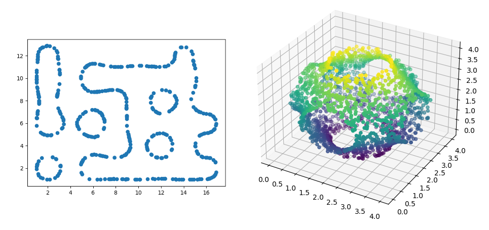

This repository presents the code used in the article "*Effective estimation of the dimension of a manifold from random samples*" whose preprint is available on arXiv: [https://arxiv.org/abs/2209.01839](https://arxiv.org/abs/2209.01839).

***

The programm is designed to do 3 different tasks :

1) Create samples of points randomly and uniformly chosen on different submanifolds of Rn.

2) Estimate the dimension of a given sample of points, using different algorithms.

3) Compute various numbers used in the aforementioned article.

The two first tasks are presentend in the notebook **examples.ipynb**.

***

The code is divided into two kind of files: Python files regrouping the main functions, and Notebooks where the aforementioned functions are used to obtain the results presented in the article.

#### Python files
- **src/paper.py:** Functions used to obtain the results of the main theorems in the article.

- **src/generators.py:** Algorithms used to sample points uniformly on different manifolds.

- **src/estimators.py:** Implementation of different estimators used in the article.

#### Notebooks
- **scales.ipynb:** We Compute the optimal scales for different dimensions and volumes.

- **gaps.ipynb:** We compute the gaps for different dimensions (see the article).

- **pairs.ipynb:** We compute the number of pairs required to obtain the desired rate of success with given scales.

- **examples.ipynb:** Two examples of generations of data sets and estimations of dimension.

- **testing.ipynb:** Testing the estimator on different manifolds.

- **anova.ipynb:** We estimate the dimension of two manifolds with the estimator of the article and with ANOVA, using the same number of points.

- **loglog.ipynb:** We compute the log-log plots to estimate the dimension of a given cloud of points.

- **real_data.ipynb:** We test estimator on the data sets contained in the folders *monkey1*, *monkey2* and *monkey3*.